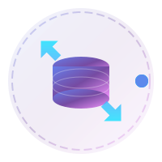
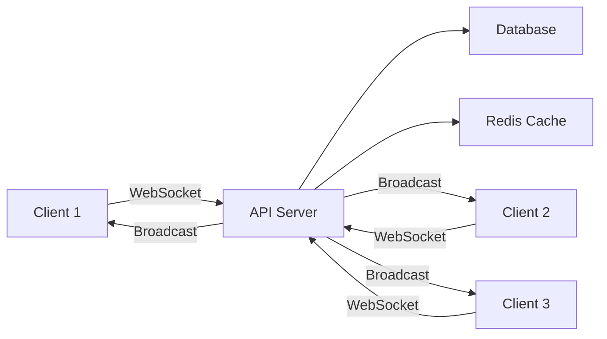

# 🔄 Sync Store

<div align="center">
  
  
  <h3>Real-time synchronized storage for distributed applications</h3>
  
  [](LICENSE)
  [](https://nodejs.org)
  [](https://www.typescriptlang.org/)
  [](https://pnpm.io/)
  
  [Features](#✨-features) • [Getting Started](#🚀-getting-started) • [Architecture](#🏗️-architecture) • [API Docs](#📚-documentation) • [Contributing](#🤝-contributing)
</div>

---

## 🎯 Overview

**Sync Store** is a powerful, real-time storage synchronization system that keeps data consistent across multiple browser instances and devices. Built with modern web technologies, it provides seamless data persistence with automatic conflict resolution and offline support.

Perfect for:
- 🎮 **Multiplayer Games** - Sync game state across players
- 💬 **Collaborative Apps** - Real-time document editing and sharing
- 🛒 **E-commerce** - Synchronized shopping carts across devices
- 📱 **Cross-device Apps** - Seamless experience across desktop and mobile
- 🔔 **Real-time Dashboards** - Live data updates without polling

## ✨ Features

### Core Capabilities
- **🔄 Real-time Sync** - Instant data synchronization across all connected clients
- **💾 Persistent Storage** - Data persists across sessions with local and remote storage
- **🔌 Offline Support** - Queue operations when offline, sync when reconnected
- **🔐 User Isolation** - Secure data separation between different users
- **⚡ WebSocket Based** - Low-latency bidirectional communication
- **🎯 Event-Driven** - React to storage changes with event listeners
- **📦 Lightweight** - Minimal bundle size with zero dependencies

### Advanced Features
- **🔄 Automatic Reconnection** - Handles network interruptions gracefully
- **📊 Conflict Resolution** - Smart versioning to handle concurrent updates
- **🎨 React Hooks** - First-class React integration with custom hooks
- **🛡️ Type Safety** - Full TypeScript support with comprehensive types
- **📈 Analytics Ready** - Built-in analytics module for usage tracking
- **🔧 Extensible** - Modular architecture for easy customization

## 🚀 Getting Started

### Prerequisites
- Node.js >= 23.11.0
- pnpm >= 10.14.0
- MariaDB or SQLite (for API server)

### Quick Start

1. **Clone the repository**
```bash
git clone https://github.com/ali-master/sync-store.git
cd sync-store
```

2. **Install dependencies**
```bash
pnpm install
```

3. **Set up the database**
```bash
# Copy environment variables
cp apps/api/.env.example apps/api/.env.local

# Run database migrations
pnpm db:setup
```

4. **Start development servers**
```bash
# Start all services
pnpm dev

# Or start individually
pnpm dev:api  # API server only
```

5. **Install the client in your app**
```bash
npm install @usex/sync-client
# or
pnpm add @usex/sync-client
```

### Basic Usage

#### JavaScript/TypeScript
```typescript
import { createRemoteStorage } from '@usex/sync-client';

// Initialize storage
const storage = createRemoteStorage({
  serverUrl: 'http://localhost:3000',
  userId: 'user123',
  autoConnect: true
});

// Store data
await storage.setItem('theme', 'dark');
await storage.setItem('preferences', { 
  language: 'en',
  notifications: true 
});

// Retrieve data
const theme = storage.getItem('theme');
const prefs = storage.getItem('preferences');

// Listen for changes
storage.on('change', (event) => {
  console.log(`${event.key} changed from ${event.oldValue} to ${event.newValue}`);
});

// Check connection status
if (storage.isOnline()) {
  console.log('Connected to sync server');
}
```

#### React Integration
```tsx
import { useRemoteStorage, useStorageItem } from '@usex/sync-client';

function App() {
  // Initialize storage hook
  const storage = useRemoteStorage({
    serverUrl: 'http://localhost:3000',
    userId: 'user123'
  });

  // Use reactive storage items
  const [theme, setTheme] = useStorageItem('theme', 'light');
  const [user, setUser] = useStorageItem('user', null);

  return (
    <div className={`app ${theme}`}>
      <button onClick={() => setTheme(theme === 'light' ? 'dark' : 'light')}>
        Toggle Theme
      </button>
      {storage.isConnected && <span>✅ Synced</span>}
    </div>
  );
}
```

## 🏗️ Architecture

### Project Structure
```
sync-store/
├── apps/
│   ├── api/              # NestJS API server
│   └── docs/             # Documentation site
├── packages/
│   ├── sync-client/      # Browser client library
│   ├── utils/            # Shared utilities
│   └── tsconfig/         # Shared TypeScript configs
├── examples/
│   ├── react-app/        # React example app
│   └── basic-usage/      # Vanilla JS examples
└── docker/               # Docker configurations
```

### Technology Stack

#### Backend (API)
- **Framework**: NestJS with Fastify adapter
- **Database**: Prisma ORM with MariaDB/SQLite
- **WebSocket**: Socket.io for real-time communication
- **Authentication**: JWT + API Key authentication
- **Caching**: Redis for session management

#### Frontend (Client)
- **Core**: TypeScript with Socket.io client
- **React**: Custom hooks for React integration
- **Storage**: LocalStorage with sync layer
- **Build**: tsup for optimized bundles

### Data Flow


## 📚 Documentation

### API Reference

#### Storage Methods
| Method | Description | Returns |
|--------|-------------|---------|
| `setItem(key, value, metadata?)` | Store an item | `Promise<void>` |
| `getItem(key)` | Retrieve an item | `any` |
| `removeItem(key)` | Remove an item | `Promise<void>` |
| `clear()` | Clear all items | `void` |
| `getAllItems()` | Get all stored items | `Promise<StorageItem[]>` |
| `getAllKeys()` | Get all keys | `string[]` |

#### Event Handlers
| Event | Description | Payload |
|-------|-------------|---------|
| `change` | Item value changed | `{ key, oldValue, newValue, source }` |
| `sync` | Sync event occurred | `{ type, key, value, metadata }` |
| `connect` | Connected to server | `{}` |
| `disconnect` | Disconnected from server | `{}` |
| `error` | Error occurred | `{ type, message, error }` |

### Configuration Options
```typescript
interface RemoteStorageConfig {
  serverUrl?: string;      // Server URL (default: http://localhost:3000)
  userId: string;          // Unique user identifier
  instanceId?: string;     // Instance ID (auto-generated)
  autoConnect?: boolean;   // Auto-connect on init (default: true)
  reconnection?: boolean;  // Enable auto-reconnection (default: true)
  timeout?: number;        // Connection timeout in ms (default: 5000)
}
```

## 🧪 Testing

```bash
# Run all tests
pnpm test

# Run tests with coverage
pnpm test:cov

# Run tests in watch mode
pnpm test:watch

# Run E2E tests
pnpm test:e2e
```

## 📦 Building

```bash
# Build all packages
pnpm build

# Build specific package
pnpm build:api

# Production build
NODE_ENV=production pnpm build
```

## 🚢 Deployment

### Docker Deployment
```bash
# Build and run with Docker Compose
docker-compose up -d

# Or use the provided scripts
cd docker/mariadb
./bootstrap.sh
docker-compose up -d
```

## 🛠️ Development

### Available Scripts

| Command | Description |
|---------|-------------|
| `pnpm dev` | Start development servers |
| `pnpm build` | Build all packages |
| `pnpm test` | Run tests |
| `pnpm lint` | Lint code |
| `pnpm format` | Format code |
| `pnpm db:migrate` | Run database migrations |
| `pnpm db:seed` | Seed database |
| `pnpm clean` | Clean build artifacts |

### Code Quality
- **Linting**: ESLint with custom configuration
- **Formatting**: Prettier with consistent style
- **Type Checking**: Strict TypeScript configuration
- **Dependency Analysis**: Knip for unused dependencies

## 🤝 Contributing

We welcome contributions! Please see our [Contributing Guide](CONTRIBUTING.md) for details.

1. Fork the repository
2. Create your feature branch (`git checkout -b feature/amazing-feature`)
3. Commit your changes (`git commit -m 'Add amazing feature'`)
4. Push to the branch (`git push origin feature/amazing-feature`)
5. Open a Pull Request

## 📄 License

This project is licensed under the Apache License 2.0 - see the [LICENSE](LICENSE) file for details.

## 🙏 Acknowledgments

Built with ❤️ by [Ali Torki](https://github.com/alitorki)

Special thanks to:
- The NestJS team for the amazing framework
- Socket.io for real-time capabilities
- The open-source community for inspiration

## 📞 Support

- 📧 Email: ali_4286@live.com
- 🐛 Issues: [GitHub Issues](https://github.com/ali-master/sync-store/issues)
- 💬 Discussions: [GitHub Discussions](https://github.com/ali-master/sync-store/discussions)
- 📖 Docs: [sync-store.usestrict.dev](https://sync-store.usestrict.dev)

---

<div align="center">
  <strong>⭐ Star us on GitHub — it motivates us a lot!</strong>
</div>
